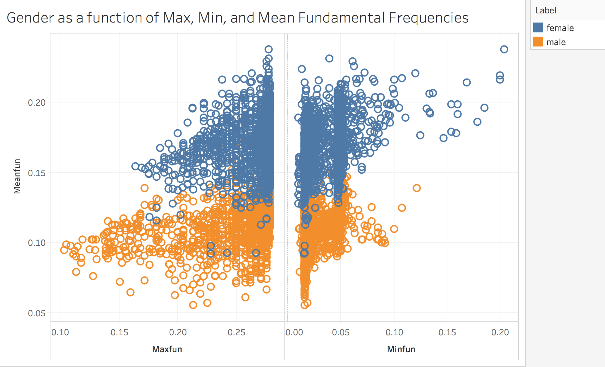
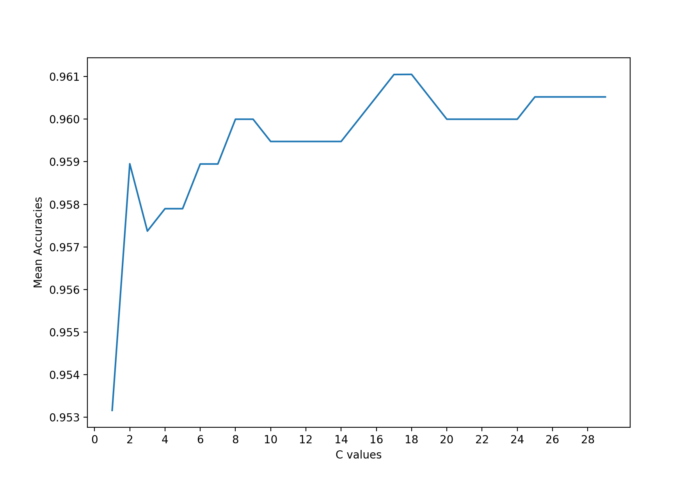
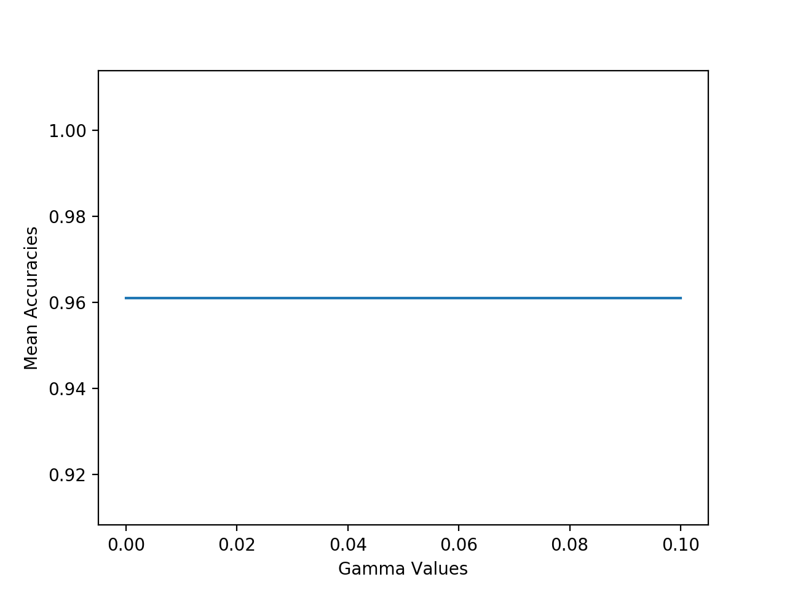

# gender_recognition_svm
## Summary
gender_recognition_svm is a python script that can detect the gender of a speaker in an audio recording using a Support Vector Machine. It was trained using the Gender Recognition by Voice kaggle set and uses pyaudio and praat scripting to record and extract features from audio segments. It performs at approximately 96% accuracy. 

## Running Script 
```
$ python ./train_svm.py
```
## Motivation
Speech processing is a rapidly growing area in the field of Machine Learning. While speech recognition has become almost ubiquitous with the technologies we use, it is seldom used for more than simply transcribing speech to text. While digital phones have introduced speech recognition to bridge the gap between human and computers, it has failed to create Artificial Intelligence that can understand more than what we are saying. To truly have seamless human-computer interaction, we must produce devices that understand more than what humans tell it. It must have clairvoyance. The prime motivation of this project is to produce a classifier that can detect the gender of a speaker. Possible real world applications of this project are: 
  - using it with existing AI technology to learn more about the user 
  - classifying the users gender as a biometric which can be used to detect fraud 

## Implementation 
Through the process of explorative data analysis, it was decided that the appropriate initial model to use would be a binary classifier that would be implemented using an SVM. The following will expand on the process used to implement the machine learning model.

### Training and Testing 
The idea of a gender classification model came when I was exploring datasets for possible projects to work on. Having worked in signal and speech processing before, I was familiar with machine learning in the field of speech analysis. The biggest problem I had found was that labeled speech data was hard to come by, and unlabeled speech data often took hours to label. What's more, extracting features from audio on python (my preference when prototyping ML models) was an even bigger pain due to the lack of audio processing libraries out there. When I came upon the Gender Recognition Data Set on Kaggle (https://www.kaggle.com/primaryobjects/voicegender), I saw an opportunity to skip the boring and time consuming tasks often required in the preprocessing phase and go directly to implementing ML. While kaggle does have examples of people implementing ML for gender recognition, I wanted to see how accurately a model trained on the data set would work in real life audio recordings. While I grew up having a rather feminine voice, puberty had made it substantially lower, and having a trained ML model identify me as a male would be instant gratification. 

### Explorative Data Analysis 
As a novice to the field of Data Science, I always like to visualize the data prior to do any sort of manipulation. When implementing a classifier, I always like to look at the distribution of the data. When visualizing the data we can see that there is equal distribution of male and female points. 


Thus using metrics such as accuracy can be a valid measure of the model's performance. 

### Feature Extraction 
Given the lack of audio processing tools accessible in python, there were only a handful of features I could extract from real audio recordings. To determine the most appropriate features, I turned to academia. In a recent paper out of Columbia University (http://www.cs.columbia.edu/speech/PaperFiles/2016/levitan_prosody16.pdf), researchers were able to get significant progress in gender classification using the fundamental frequency and MFCC's. Luckily, the data set I had contained feature data on mean,minimum, and maximum fundamental frequency in the recordings. Having a possible set of features, I then tried to visualize the data as a function of these features.  


Thus we can see here a clear separation from male and female data points. The data can easily be segmented by simply running a line through the middle and give us a pretty good accuracy. 

### Model Selection 
Given my familiarity with it, I have chosen to use an SVM binary classifier as primary model. A future iteration of this project would be to implement another algorithm and calculate accuracy. 

### Hyperparameter Tuning 
The first parameter that was tested was the SVM kernel type. The Kernels define the way of separating the data into dinstinct clusters. Linear kernel methods work by segmenting the data through linear boundaries, while polynomial and rbf methods segment the data using non-linear boundaries. The following shows the mean accuracies of each kernel method through cross-validation of 10 iterations using a training set composed of 60% of the data. All other hyperparameters were set to default.

| Kernel Method  |Mean Accuracy |
| ------------- | ------------- |
| Linear  | 95.32%  |
| rbf  | 94.78%  |
| Polynomial | 50.63% | 

Thus as mentioned before, the data looked easily segmentable through a linear boundary. We can see here this stands true as the linear kernel method performs the best over all options. 

The next value to be tuned is the C value of the SVM. A SVM works to perform two functions: to correctly separate the points and to create a hyperplane that maximises the separation between two groups. However it is not always the case that both can happen at the same time. The C value allows us to specify which of the two functions we prefer. In this case we simply need want the C value that gives us the highest accuracy: 


The final parameter to be tuned is the gamma value. The gamma value dictates how solwly the svm converges to a value by setting the jump value. When tuning the gamma value, we found no significant change in accuracy with changes in the gamma val. Thus the gamma value of 0.00001 was chosen. 


After fine tuning the parameters, the SVM was then run on our testing set and found to have an accuracy of 95.66%. 

## Results 
Despite being trained on a publicly available training set, the model performs very well when guessing the gender of actual recordings of speech. I tested the performance of the model on 8 genuine recordings of the utterance "hello" by two different speakers (1 male, 1 female). The SVM correctly identified the gender in all 8 tests. Where the SVM begins to show faults is when gender is impersonated. On recordings where a female might pretend to sound like a male, the model consistently recognized the correct gender. However, when males pretended to sound like females, the SVM was not as consistent. Further testing must be done to give appropriate quantitative values. Likewise, the SVM also fails to detect the gender of a child. This is most likely since the training data set only contained points from adults. A more diverse data set could solve this problem. 
