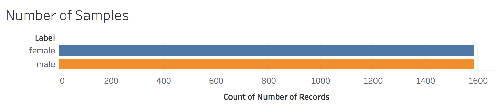

# gender_recognition_svm

##Motivation
Speech processing is a rapidly growing area in the field of Machine Learning. While speech recognition has become almost ubiquitous with the technologies we use, it is seldom used for more than simply transcribing speech to text. While digital phones have introduced speech recognition to bridge the gap between human and computers, it has failed to create Artificial Intelligence that can understand more than what we are saying. To truly have seamless human-computer interaction, we must produce devices that understand more than what humans tell it. It must have clairvoyance. The prime motivation of this project is to produce a classifier that can detect the gender of a speaker. Possible real world applications of this project are: 
  - using it with existing AI technology to learn more about the user 
  - classifying the users gender as a biometric which can be used to detect fraud 

##Implementation 
Through the process of explorative data analysis, it was decided that the appropriate initial model to use would be a binary classifier that would be implemented using an SVM. The following will expand on the process used to implement the machine learning model.

###Training and Testing 
The idea of a gender classification model came when I was exploring datasets for possible projects to work on. Having worked in signal and speech processing before, I was familiar with machine learning in the field of speech analysis. The biggest problem I had found was that labeled speech data was hard to come by, and unlabeled speech data often took hours to label. What's more, extracting features from audio on python (my preference when prototyping ML models) was an even bigger pain due to the lack of audio processing libraries out there. When I came upon the Gender Recognition Data Set on Kaggle (https://www.kaggle.com/primaryobjects/voicegender), I saw an opportunity to skip the boring and time consuming tasks often required in the preprocessing phase and go directly to implementing ML. While kaggle does have examples of people implementing ML for gender recognition, I wanted to see how accurately a model trained on the data set would work in real life audio recordings. While I grew up having a rather feminine voice, puberty had made it substantially lower, and having a trained ML model identify me as a male would be instant gratification. 

###Explorative Data Analysis 
As a novice to the field of Data Science, I always like to visualize the data prior to do any sort of manipulation. When implementing a classifier, I always like to look at the distribution of the data. When visualizing the data we can see that there is equal distribution of male and female points. 

Thus using metrics such as accuracy can be a valid measure of the model's performance. 

###Feature Extraction 
Given the lack of audio processing tools accessible in python, there were only a handful of features I could extract from real audio recordings. To determine the most appropriate features, I turned to academia. In a recent paper out of Columbia University (http://www.cs.columbia.edu/speech/PaperFiles/2016/levitan_prosody16.pdf), researchers were able to get significant progress in gender classification using the fundamental frequency and MFCC's. Luckily, the data set I had contained feature data on mean,minimum, and maximum fundamental frequency in the recordings. Having a possible set of features, I then tried to visualize the data as a function of these features.  
